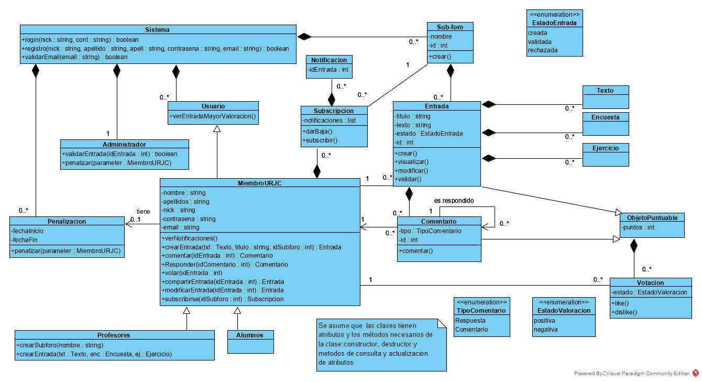

#  P2-Grupo05
 RedditURJC Practica2 MetodologíaDeLaProgramación
# RedditURJC
 - [Name of the application](#Name-of-the-application)
 - [Members of the development team](#Members-of-the-development-team)
 - [Teachers](#Teachers)
 - [Requirements](#Requirements)
 - [Class UML Diagram](#Class-UML-Diagram)
 - [Funcionamiento Interfaz Sistema implementada por REDDITURJC](#INTERFAZ)

Development Environment
Class UML Diagram

## Name of the  application ##
RedditURJC

## Members of the development team ##
| Name | Mail | GitHub |
| ---- | ---- | ------ |
| Israel Peñalver Sánchez | i.penalver.2016@alumnos.urjc.es | [IsraelSonseca](https://github.com/IsraelSonseca) |
| Pablo Atahonero Garcia De Blas |	p.atahonero.2017@alumnos.urjc.es |	[PabloAtahoneroGB](https://github.com/PabloAtahoneroGB) |
| Eduardo Ivorra Salinas |	e.ivorra.2017@alumnos.urjc.es |	[EduardoIvorra](https://github.com/EduardoIvorra) |
| Allan Robert Cobb Bellido |	a.robert.2017@alumnos.urjc.es|	[Allanmaster](https://github.com/Allanmaster) |

## Teachers ##
| Name | Mail | GitHub |
| ---- | ---- | ------ |
| Antonio Gonzále Pardo | antonio.gpardo@urjc.es | [agpardo](https://github.com/agpardo) |
| Jonathan Crespo Herrero |	jonathan.crespo@urjc.es |	[robojon](https://github.com/robojon) |

## Requirements ##
[DocumentodeRequisitos](./doc/Enunciado_P1-editado.pdf)
https://1drv.ms/b/s!AsOMPQ_2QuND4yy-xF5A4uUEMVx9?e=7nGh5Z

## Class UML Diagram ##

## INTERFAZ ##
[DocumentodeRequisitos](./doc/memoria.pdf)
https://1drv.ms/b/s!AsOMPQ_2QuND4yy-xF5A4uUEMVx9?e=7nGh5Z
